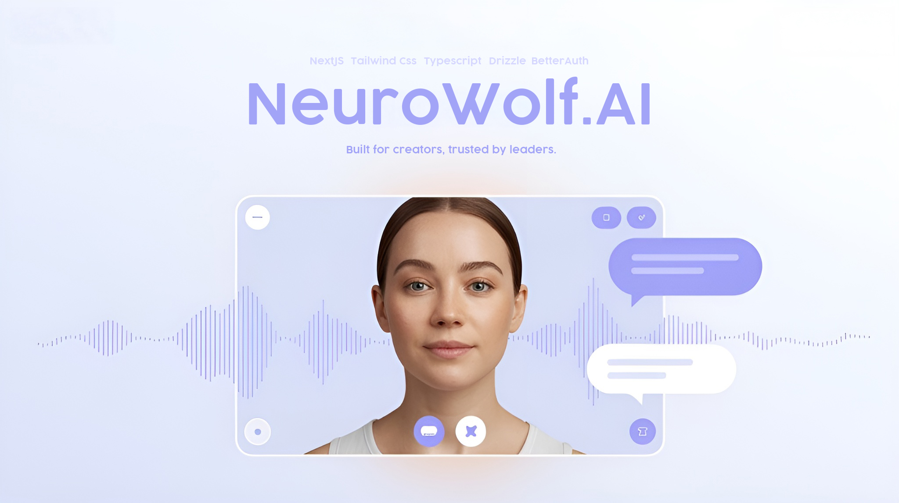

  

🐺 Neurwolf

Neurwolf is an AI SaaS platform where users can subscribe, create custom AI agents with their own instructions, schedule meetings, and even hold voice calls with AI agents. Each meeting generates a transcript and more powerful features are coming soon.

🚀 Features

🔑 Authentication & Subscriptions – powered by BetterAuth & integrated payment

🤖 AI Agents – create and manage custom AI agents with your own instructions

📅 Meeting Scheduling – schedule 1:1 meetings with your AI agents

🎙️ Voice Calls with AI – real-time voice conversations with agents

📝 Transcripts – full transcripts available after each call

📬 More features coming soon...

🛠️ Tech Stack

⚡ Next.js 14 – React framework for production apps

🟦 TypeScript – type safety everywhere

🎨 Tailwind CSS – utility-first styling

🔌 tRPC – fully typesafe API layer

🗂️ Prisma – ORM for database modeling

🟢 Neon DB – Postgres on the cloud

🔐 BetterAuth – authentication & session management

🧠 OpenAI API – powering the AI agents & conversations

🌀 nuqs – query state management
